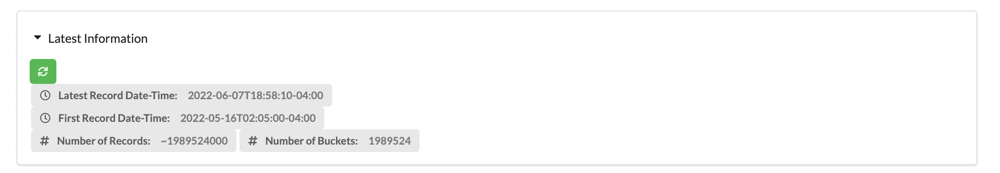
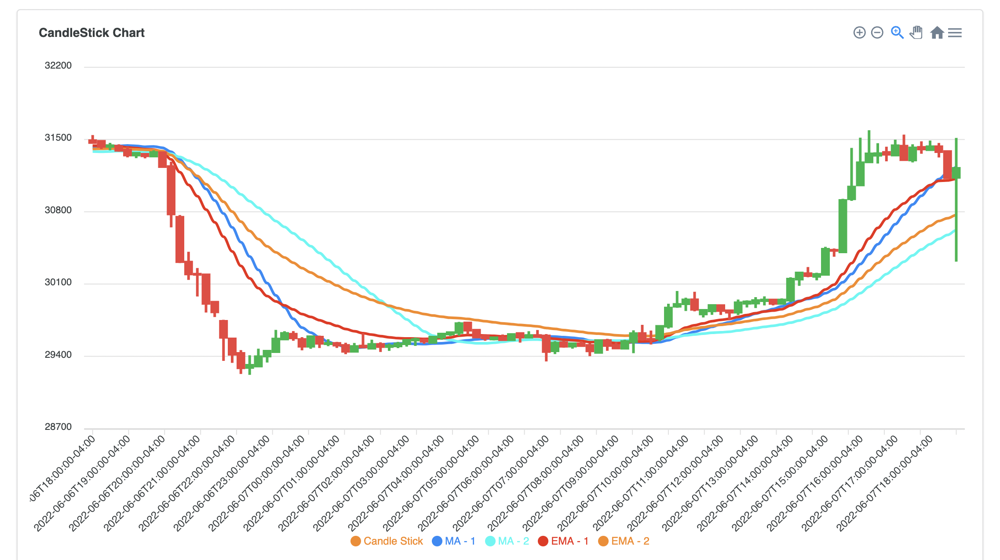
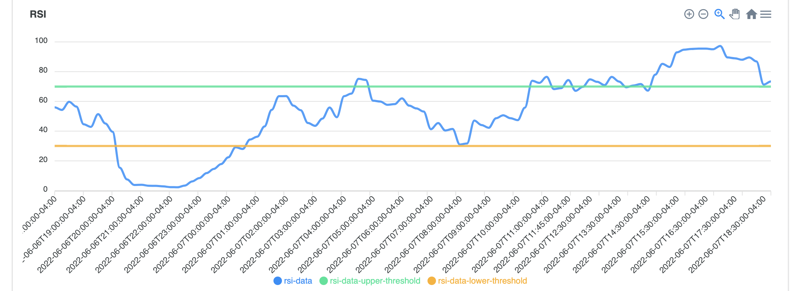
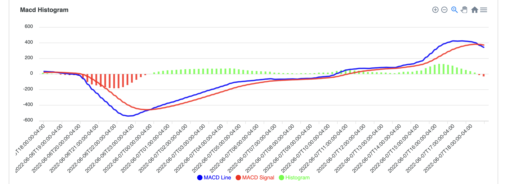
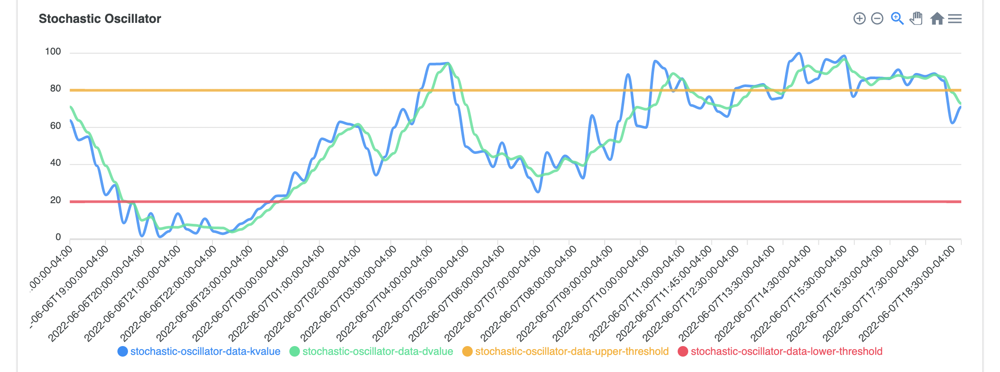

# React Web Application for MongoDB Ticker Data Analysis

This repository includes the source code of the React Web Component of an [Atlas App Services Application](https://www.mongodb.com/docs/atlas/app-services/) that is an end-to-end application to analyze financial market data. This React App connects to MongoDB Atlas through [MongoDB Realm WEB SDK](https://www.mongodb.com/docs/realm/web/). 

Please review [the other repository](https://github.com/afsungur/mongodb-ticker-analysis-atlas-app) that covers how to deploy the Atlas App Services Application.

## Resources to review before working on this project:
- https://www.mongodb.com/developer/article/time-series-candlestick/ 
- https://www.mongodb.com/developer/article/time-series-candlestick-sma-ema/
- https://www.mongodb.com/developer/article/time-series-macd-rsi/
- https://www.investopedia.com/terms/t/technicalindicator.asp
- https://www.investopedia.com/terms/t/technicalanalysis.asp

## Pre-Requisites of Running the React Application

- Before uploading the files on a hosting, test everything on a local machine or server.
- Clone this repository. 
- And change the current directory to this folder.
	- ```bash
		cd mongodb-ticker-analysis-react-app
		```
- Make sure you've installed minimum version of the following `node` and `npm` on the machine that you are going to test this React app.
	- ```bash
		node --version
		v17.8.0

		npm --version
		8.5.5
		```


- Make sure that you've followed the instructions given in [the other repository](https://github.com/afsungur/mongodb-ticker-analysis-atlas-app) that covers the steps of deploying an Atlas App Services Application. In order to run this React Application without any problem, you need to have Atlas App Services Application first. 
- After you successfully created a Atlas App Services Application, note the `id` of it.
- Some data should have already been populated in the database if you've successfully deployed the App Services Application.
- Change the `REALM_APP_ID` parameter in the `public/config.js` file in this repo accordingly with the App Services Application Id that you got from the previous step.

- Run the given command to install npm packages
	- ```bash
		npm install
		```

## Running the React Application 

- Make sure you `node_modules/` folder has been created after you installed the application through `npm install`.
- Run the development server:
	- ```bash
		npm start
		```

- After a while, it automatically launches a new tab in the default browser with the following url ```http://localhost:3000/```

## Verification of the Configuration
- In order to make sure that this React Application connect to both App Services Application and Atlas Database Cluster, check the followings out:
	- Check the "Latest Information" section on the main page. After a few seconds, some stats need to be displayed as shown in the below.
	-  


## Building React Application


## Example Screenshots

### Form


### Candlestick Charts


### RSI



### MACD


### Stochastic Oscillator



> Written with [StackEdit](https://stackedit.io/).
